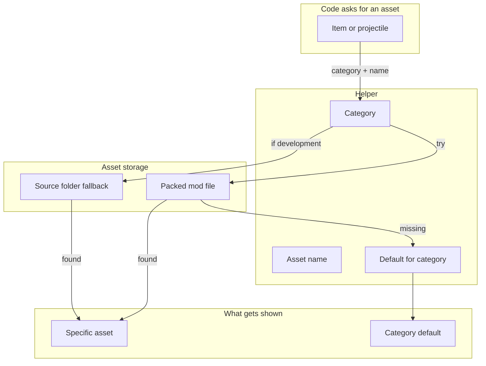

# Asset and Sound Loading - How It Works

This document describes how the mod locates its textures and sounds. No implementation details are listed here - only the conceptual organization and the order in which a texture or sound is resolved.

The mod's visuals and audio are organized into categories. Each category has its own folder. Every asset is referenced through a small helper that knows the category, and any missing asset is automatically replaced with a default that belongs to its category.

### Concepts

- Assets are organized by **category**. Items, weapons, accessories, projectiles, and buffs each have their own folder. The category of an asset is determined by what the asset represents, not by what file extension it has.
- Each concrete item asks the helper for its texture by **category and name**. The helper builds the path to the asset based on the category, then checks whether the asset exists.
- When an asset is **missing**, the helper falls back to a default that belongs to the same category. The player sees a placeholder for that category rather than an error or a missing texture.
- This means a mod can ship a **few defaults** and let the rest of the items fall back to those defaults during development. New items automatically pick up a sensible look without requiring a new texture to be drawn.
- The same approach is used for **sounds**. The bark, cry, growl, and pat pools are populated by enumerating the files in each sound folder. The pat pool belongs to the petting system. The enumeration works against the packed mod file and, in development, against the source folders.
- Sound pools can also be addressed by **index**. A pool keeps its enumerated order, so a networked effect can name one clip by its index and every client plays exactly the same recording. This is how synchronized effects such as barks stay identical for everyone who hears them.
- The **filesystem fallback** for sounds only matters during development. In the released mod, sounds are read directly from the packed mod file, and the filesystem paths are never consulted.
- **Naming consistency** matters. An item's asset name matches the item's class name. A change to the class name requires a corresponding rename of the asset, or the fallback will kick in.
- The **default itself is a real asset** drawn or recorded by the mod's author. It is the visual identity of the category when no specific asset is provided.

### Work Sequence

1. **Mod loads** - the helper registers the categories. Each category is associated with a folder and a default asset.
2. **An item is constructed** - the item's class is instantiated and asks the helper for its texture by category and name.
3. **Helper checks the packed mod file** - the helper looks for the specific asset. If it exists, that asset is used.
4. **Helper falls back to the category default** - if the specific asset is missing, the helper returns the default for the category. The item displays with the default's look.
5. **Sound pools are populated** - the bark, cry, growl, and pat pools enumerate their respective folders. Each found file becomes a candidate sound in its pool.
6. **A sound is played** - when a bark, cry, growl, or pat is triggered, a sound is chosen from the appropriate pool. Playback may be local, or driven by a network broadcast when the sound is synchronized; in the network case the exact clip is addressed by index so every client plays the same recording.
