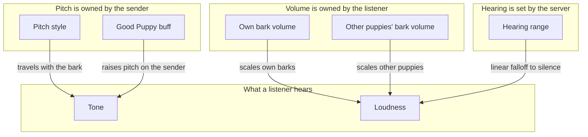

# Bark Audio Config - How It Works

This document describes how the bark audio configuration is exposed to the player. No implementation details are listed here - only what the player can choose and how the choices shape what they hear.

A bark's tone is chosen from a small set of named pitch profiles. The names are presented as a slider with notches instead of a number line. A bark's loudness is split into two continuous percentages: one for the player's own barks and one for other puppies' barks. The pitch style is owned by the sender, so each player chooses how their barks sound to everyone. The two volumes are owned by the listener, so each player chooses how loud barks are to their own ears. The server decides how far a bark can be heard.

### Concepts

- The pitch style is a **named profile**, not a raw number. Each profile has a friendly name and a fixed underlying pitch. The player does not see or edit a number; they pick a name.
- The profiles are presented as a **slider with notches** rather than a dropdown. The slider has one notch per profile, and the currently selected notch shows the profile's name. The slider enforces that only valid profiles can be chosen.
- The profiles are **ordered by pitch** from lowest to highest. The lowest is the deepest, the highest is the squeakiest. Picking a profile near one end produces a noticeably different bark from picking near the other end.
- The **default profile** is near the middle - a balanced, happy tone that suits most puppies without standing out.
- The pitch style is **owned by the sender**. The player chooses how their own barks sound, and that choice travels with the bark to everyone who hears it. Other players cannot restyle the player's barks, and the player cannot restyle theirs.
- The **Good Puppy buff** raises the pitch slightly on the sender's side. While the buff is active, any bark the player sends is pitched up a little; listeners hear the raised tone without doing anything themselves.
- The player has **two volume sliders**: one for their own puppy and one for other puppies. Both are continuous percentages with no preset steps; both default to a half, a noticeable but not loud bark.
- The **own volume** applies to every sound the player's own puppy makes: barks, cries, and growls. The **other puppies' volume** applies to every sound other puppies make in the player's ears. There is no per-sound override.
- The volumes are **per-listener**. The sender's volume choices do not travel with the bark; each player hears every bark at the level they configured for its source.
- The two volumes are **independent** of each other and of the pitch style. Changing one does not change the others, and the player can pick any combination.
- The **hearing range** is a server setting. A server can disable barks entirely, set a range in tiles, or set the range to zero for no limit. The default range is 75 tiles, adjusted in steps of 5.
- With a range set, the heard volume **falls off linearly with distance**. A bark is silent beyond the range and slightly louder than the configured volume at close range. With a range of zero, there is no falloff and everyone on the server hears the bark at their configured volume.

### Work Sequence

1. **Mod loads** - the client config is registered. The default pitch profile and both default volumes are applied if no saved config exists; the server config supplies the default hearing range and the global bark toggle.
2. **Player opens the mod config** - the pitch style appears as a notched slider resting on the default profile, with the own bark volume and other puppies' bark volume sliders beside it.
3. **Player picks a new pitch profile** - the slider's notch moves. The choice is remembered and shapes every bark the player sends from then on; everyone who hears the bark hears the same style.
4. **Player adjusts the volumes** - the own volume shapes the player's own barks, cries, and growls, while the other volume shapes what the player hears from other puppies. Both values are remembered.
5. **Puppy barks in multiplayer** - the server checks the hearing range and tells the clients whether to play the bark. Each listener applies its own volume plus the linear distance falloff, so a close bark is a little louder than the configured volume and a bark beyond the range is silent.
6. **Good Puppy is active** - the sender's bark travels with a slightly raised pitch, and each listener still applies their own volume on top of it.
