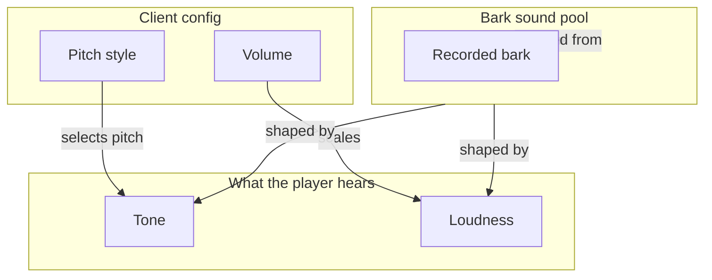

# Bark Audio Config - How It Works

This document describes how the bark audio configuration is exposed to the player. No implementation details are listed here - only what the player can choose and how the choices shape what they hear.

A bark's tone is chosen from a small set of named pitch profiles. The names are presented as a slider with notches instead of a number line. A bark's loudness is chosen as a continuous percentage. Both are client-side settings; each player can pick their own.

### Concepts

- The pitch style is a **named profile**, not a raw number. Each profile has a friendly name and a fixed underlying pitch. The player does not see or edit a number; they pick a name.
- The profiles are presented as a **slider with notches** rather than a dropdown. The slider has one notch per profile, and the currently selected notch shows the profile's name. The slider enforces that only valid profiles can be chosen.
- The profiles are **ordered by pitch** from lowest to highest. The lowest is the deepest, the highest is the squeakiest. Picking a profile near one end produces a noticeably different bark from picking near the other end.
- The **default profile** is a middle one - a balanced, happy tone that suits most puppies without standing out.
- The volume is a **continuous percentage**. The player drags a slider anywhere along the way. There are no preset steps; the value can be anything within the range.
- The **default volume** is a half, which is a noticeable but not loud bark. Players can lower it to make their barks almost silent or raise it to match the loudest sounds in the game.
- The volume applies to **every sound the puppy makes**: barks, cries, and growls. There is no per-sound override.
- The two settings are **independent**. Changing the pitch does not affect the volume, and changing the volume does not change the pitch. The player can pick any combination.
- These settings are **per-client**. One player's choices do not affect what other players hear; each hears their own puppy's bark shaped by their own config.

### Work Sequence

1. **Mod loads** - the config is registered. The default pitch profile and default volume are applied if no saved config exists.
2. **Player opens the mod config** - the pitch style is shown as a notched slider, currently resting on the default profile. The volume is shown as a continuous slider, currently resting on the default.
3. **Player picks a new pitch profile** - the slider's notch moves to a different profile. The new profile is remembered and used on the next bark.
4. **Player picks a new volume** - the volume slider moves. The new percentage is remembered and applied to the next bark, cry, or growl.
5. **Puppy barks** - on the next bark, the chosen pitch profile and volume are applied to the recorded sound. The puppy client sends the result through the local audio system.
6. **Other players do not hear a difference** - each player hears their own puppy's bark shaped by their own config. The shape is purely client-side.
