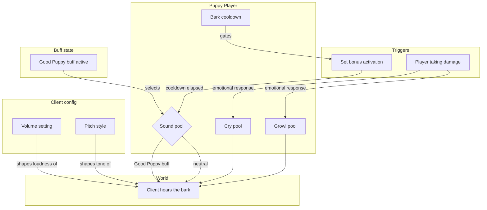

# Bark System - How It Works

This document describes the intended behavior of the bark system. No implementation details are listed here - only the conceptual relationships and the order in which things happen.

A bark is a sound emitted by a puppy. The system decides when a bark is triggered, which pool of sounds to draw from, how loud it should be, and what tone it takes. A separate set of sounds is used for emotional responses like being hurt.

### Concepts

- A **bark pool** is a collection of recorded bark sounds. One pool is used for happy barks, another for distress, another for growls. The active pool is chosen by the situation, not by the player.
- A **set bonus** is the in-game label that appears when a player is wearing both the dog ears and the dog tail. Activating this set bonus is one way to bark on demand.
- A **bark cooldown** prevents barks from stacking. Once a bark has played, another cannot be triggered until enough time has passed. This applies to set-bonus barks, not to emotional barks.
- The **Good Puppy buff** is granted to a puppy that has been praised by a clicker. While this buff is active, a bark's tone is raised slightly, signalling a happy moment.
- The bark's **tone** is shaped by a player-chosen style. The style is a discrete choice from a small set of named pitch profiles, rendered as a slider with notches. The choice has no gameplay effect; it is purely cosmetic.
- The bark's **loudness** is shaped by a player-chosen volume. Volume is a continuous percentage and applies to every bark, cry, and growl.
- **Hurt sounds** are not barks. When a puppy takes damage, the system plays either a cry or a growl depending on the severity of the moment. A death always triggers a cry. Other hits roll a chance to play a growl rather than a cry. Hurt sounds bypass the set-bonus cooldown.
- All barks, cries, and growls are recorded by the mod's author. Volume, pitch, and pool selection shape the experience, but the underlying recordings are the source.

### Work Sequence

1. **Puppy equips both ears and tail** - the set bonus is now active. The puppy is eligible to bark on demand.
2. **Player triggers the set bonus** - the puppy is asked to bark. The cooldown is checked.
3. **Cooldown check** - if the cooldown is still ticking, nothing happens. If it has elapsed, a bark is played and the cooldown resets.
4. **Tone and loudness are applied** - the player's chosen pitch style and volume are applied to the bark before it is heard.
5. **Pitch is raised if praised** - if the puppy currently has the Good Puppy buff, the bark's tone is raised slightly to express happiness.
6. **Hurt override** - if the puppy takes damage during any of the above, the hurt path takes over: a cry or growl plays immediately, ignoring cooldown, and the situation is signalled instead of a normal bark.
7. **Death override** - if the hit is fatal, a single cry plays. No growl is rolled, and the puppy does not get to bark in response to a death.
