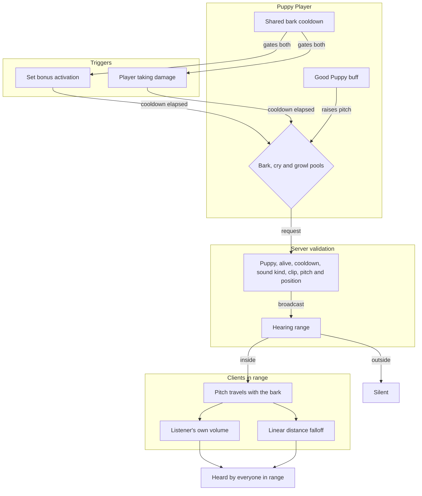

# Bark System - How It Works

This document describes the intended behavior of the bark system. No implementation details are listed here - only the conceptual relationships and the order in which things happen.

A bark is a sound emitted by a puppy. The system decides when a bark is triggered, which pool of sounds to draw from, how loud it should be, and what tone it takes. A separate set of sounds is used for emotional responses like being hurt. Barks are synchronized in multiplayer: the client asks, the server validates and broadcasts, and every client in range hears the same bark.

### Concepts

- A **bark pool** is a collection of recorded bark sounds. One pool is used for happy barks, another for distress, another for growls. The active pool is chosen by the situation, not by the player.
- A **set bonus** is the in-game label that appears when a player has any recognized Puppy Ears and any recognized Tail in an accessory location. The families do not have to match. Activating this set bonus is one way to bark on demand.
- **Barks are synchronized in multiplayer.** The sender plays a local prediction immediately and asks the server. The server validates that the player is a puppy, is alive, is off cooldown, and that the sound kind, clip index, pitch style and position are valid; then it broadcasts the bark to every client in hearing range. The dedicated server never plays the sound itself. Everyone in range hears the bark.
- A **bark cooldown** prevents barks from stacking. Once a bark has played, another cannot be triggered until enough time has passed. The **same cooldown gates both set-bonus barks and hurt sounds**.
- The **Good Puppy buff** is granted to a puppy that has been praised by a clicker or petted. While this buff is active, a bark's tone is raised slightly on the sender's side, signalling a happy moment. Hurt sounds keep their normal pitch.
- The bark's **tone** is owned by the sender. It comes from a player-chosen style: a discrete choice from a small set of named pitch profiles, rendered as a slider with notches. The choice has no gameplay effect; it is purely cosmetic, and it travels with the bark to every listener.
- The bark's **loudness** is owned by each listener. Every client has two volume settings - one for their own puppy and one for other puppies - and each applies the matching volume when a bark plays. The listener also applies the server's distance falloff.
- The **server settings** control the bark path. A global toggle can disable barks entirely. The hearing range defaults to 75 tiles and is adjusted in steps of 5; a range of zero means no limit. With a range set, the bark volume falls off linearly with distance: silent beyond the range and slightly louder than the configured volume at close range. With a range of zero, there is no falloff and everyone hears the bark.
- **Hurt sounds** are not barks. When a puppy takes damage, the system plays either a cry or a growl depending on the severity of the moment. A death always triggers a cry. Other hits roll a chance to play a growl rather than a cry. Hurt sounds obey the same shared cooldown as set-bonus barks.
- The **Shiny Ears star burst** is still a client-side cosmetic, but it now also plays on observing clients when they receive the broadcast of another puppy's bark.
- All barks, cries, and growls are recorded by the mod's author. Volume, pitch, and pool selection shape the experience, but the underlying recordings are the source.

### Work Sequence

1. **Puppy equips recognized Ears and a Tail** - any recognized Ears plus any recognized accessory Tail activates the set bonus. A matching family pair is not required for barking.
2. **A trigger fires** - activating the set bonus, or taking damage, asks the puppy to make a sound. The shared cooldown is checked first.
3. **Cooldown check** - if the cooldown is still ticking, nothing happens. If it has elapsed, the sound proceeds. The same cooldown applies to set-bonus barks and hurt sounds.
4. **Tone and loudness are prepared** - a clip is chosen from the appropriate pool, and the sender's pitch style is applied. If the Good Puppy buff is active, the bark's tone is raised slightly.
5. **Singleplayer playback** - when no networking is involved, the sound plays for the local player.
6. **Multiplayer request** - the sender's client plays a local prediction immediately for zero-latency feedback, then sends a request with the sound kind, clip index, pitch style and position.
7. **Server validation and broadcast** - the server checks that the sender is a puppy, is alive, is off cooldown, and supplied a valid sound kind, clip index and pitch style with a sane position. Valid requests are broadcast to every client within hearing range, and the dedicated server stays silent.
8. **Listeners apply their own settings** - each receiving client picks the volume that matches the emitter and applies the server's linear distance falloff: closer is louder, beyond the range is silent, and a range of zero means no falloff at all. Observers also see the Shiny Ears star burst when the emitter wears Shiny Ears.
9. **Hurt path** - if the puppy takes damage, a cry or growl is prepared instead. A fatal hit always plays a cry; otherwise there is a chance of a growl. The shared cooldown still applies, so a hurt sound cannot stack on top of a recent bark.
