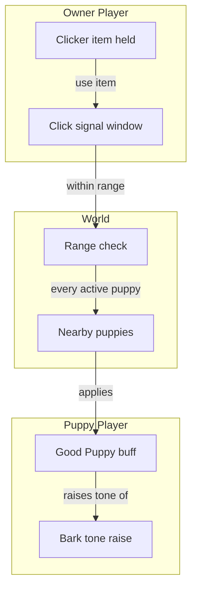

# Clicker Praise System - How It Works

This document describes the intended behavior of the clicker praise system. No implementation details are listed here - only the conceptual relationships and the order in which things happen.

A clicker is an item held by an owner. When used, it praises every nearby puppy at once. Praised puppies receive a temporary happy buff. The clicker is the only way for an owner to grant this buff.

### Concepts

- A **clicker** is a held item. Only the holder of a clicker can praise; puppies cannot praise themselves.
- The **click signal** is a short window of time during which the clicker is considered to have just been used. The window is short enough that successive clicks do not stack, but long enough that the buff can be applied to all puppies in range before the signal expires.
- **Range** is set by the clicker item itself. Each clicker variant has its own range. Puppies outside that range are not affected.
- The **Good Puppy buff** is what the clicker grants. While the buff is active, the puppy's stats are slightly improved and any bark the puppy makes is rendered at a higher pitch to express happiness.
- **Puppy detection** is based on the resolved Puppy set. A player counts as a puppy when any recognized Ears and any recognized Tail in an accessory location are present; the families do not have to match. The buff is applied only to those who are puppies at the moment the signal is processed.
- The clicker is **automatic and inclusive** - one click praises every puppy in range. There is no per-puppy targeting; the owner does not need to aim at any individual puppy.
- Puppies do not need to acknowledge the praise. The buff is applied silently through the network state and only manifests later through stat changes and bark pitch.

### Work Sequence

1. **Owner equips a clicker** - the clicker becomes the held item. The owner's range is set by the clicker variant in use.
2. **Owner uses the clicker** - the clicker is consumed for this action. A click signal begins. The sound of a click is heard nearby.
3. **Nearby puppies are detected** - the world is scanned for all players who are currently puppies. A puppy has any recognized Ears and any recognized accessory Tail; a matching family pair is not required.
4. **Range check** - for each detected puppy, the distance from the owner is compared to the clicker's range. Puppies in range are kept; others are skipped.
5. **Buff is applied to each in-range puppy** - the Good Puppy buff is added to each kept puppy. The buff duration is set by the clicker variant.
6. **Bark tone reflects the buff** - from this point on, until the buff expires, any bark the puppy produces uses a slightly raised pitch. No other indication of the buff is broadcast.
7. **Buff expires** - after the configured duration, the buff ends on its own. Stats return to their previous values and subsequent barks use the normal pitch again.
