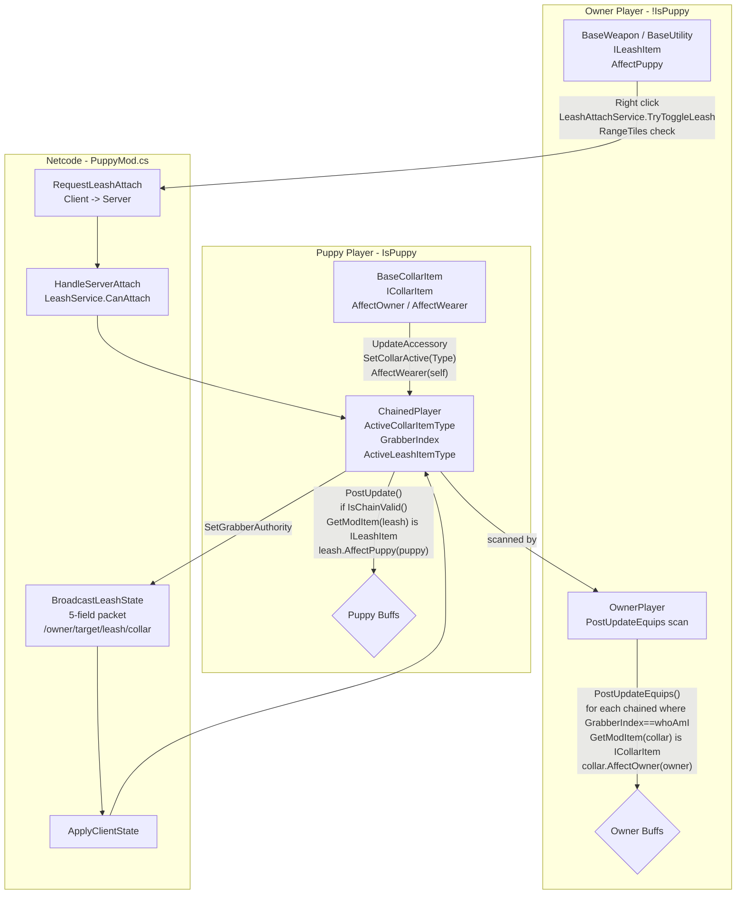

# Leash–Collar System - How It Works

This document describes the intended behavior of the leash and collar system. No implementation details are listed here - only the conceptual relationships and the order in which things happen.

Two core relationships:

- **Puppy wearing a collar affects the owner** when that puppy is leashed.
- **Owner holding a leash affects the puppy** when the leash is attached.

A collar always provides a benefit to its wearer while equipped, and an additional benefit to the owner while the puppy is leashed by someone. A leash never benefits its holder directly; it benefits the puppy on the other end of the leash while the connection is active.

### Concepts

- A **collar** is an accessory worn by a puppy. It is always active for the wearer and becomes relevant to an owner only while that puppy is leashed by that owner. Collars are differentiated by material and tier, each providing a distinct kind of benefit oriented toward the owner when the leash connection exists.
- A **leash** is an item held by an owner. It is used to attach to a puppy that is wearing a collar. While attached, the leash continuously affects the puppy. Utility leashes and weapon leashes differ only in whether they also deal damage; both follow the same rule of affecting the puppy, not the owner.
- A **leashed connection** is valid only while the puppy remains a puppy, is wearing a collar, the owner is active and is not a puppy, and the owner is within leash range. The connection is maintained by physics and is cleared on detachment, death, or when validity is lost.
- **Networking** is server-authoritative. The client requests to attach or detach; the server validates that the owner can leash the target, updates the puppy's authority, and broadcasts the current leash state to all clients. Rejoining players receive the current state through a sync.

### Work Sequence

1. **Puppy equips a collar** - the collar becomes the puppy's active collar and applies its wearer effect to the puppy. The puppy is now eligible to be leashed.
2. **Owner attempts to leash the puppy** - the owner, while holding a leash and within range, uses the leash's alternate action targeting the puppy. The request is sent to the server.
3. **Server validates and establishes the link** - the server checks that the owner is not a puppy, the target is a puppy with a collar, and the held item is valid. If valid, the puppy's leash state is updated to point to the owner and the current collar, and the new state is broadcast.
4. **While leashed, the leash affects the puppy** - each tick the puppy's leash state is checked for validity and, if valid, the leash's effect is applied to the puppy. The leash also contributes its physics and visual rope.
5. **While leashed, the collar affects the owner** - each tick the owner scans for puppies leashed to them and, for each, applies that puppy's collar effect to the owner. An owner leashing multiple puppies accumulates the effects of each collar.
6. **Detachment and cleanup** - detaching, moving out of range, death, removing the collar, or losing puppy status invalidates the link, clears the leash state, and removes the ongoing effects on both sides.
