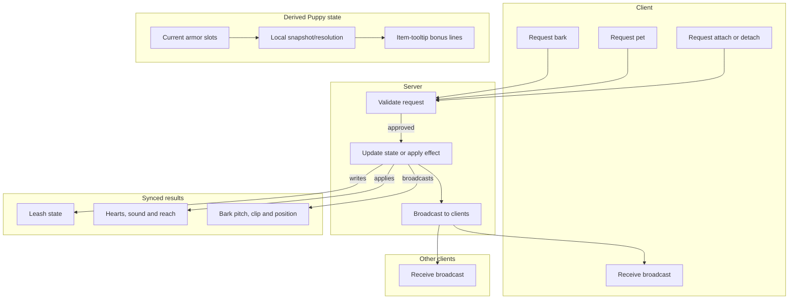

# Network Sync Model - How It Works

This document describes the synchronization model used by the Puppy equipment, leash, petting and barking systems in multiplayer. Equipment resolution is derived locally from the current armor slots; leash attachment, petting and barking are explicitly server-authoritative. No custom packet is used to send a Puppy set snapshot.

Leash attachment, petting and barking all follow the same request, validate and broadcast shape. The client never decides on its own whether a leash connects, a pet lands or a bark is heard; it asks the server, the server validates, and the result is broadcast back to every client. This keeps multiple players seeing and hearing the same thing. Each side resolves recognized Ears/Tails from its synchronized armor slots, while the server remains authoritative for attachment-dependent gameplay effects.

### Concepts

- The server is the **single source of truth** for any leash connection. Whatever the server says is leashed, is leashed. Clients never modify the leash state directly.
- The Puppy set is **derived state**, not a separately synchronized set flag. The scanner reads the current vanilla armor array on each simulation, resolves the recognized Ears/Tails and their effects, and exposes `IsPuppy`. Normal Terraria equipment synchronization supplies the slots.
- A **request** is what a client sends when it wants the server to act: attach or detach a leash, pet a target, or emit a bark. The request identifies the target and the parameters of the action.
- **Validation** is what the server does with a request. For leashes it checks that the requester is not a puppy, the target is a puppy wearing a collar, the leash type is held, and the target is in range. If any check fails, the request is silently dropped.
- **Authority** is what the server updates when a request is approved. The puppy's leash state is set to point at the owner, and the active collar type is captured so it can be broadcast.
- A **broadcast** is what the server sends to every client after approving a request. Each client receives the result and applies it to its local view. The same broadcast is what the requesting client uses to confirm its own action.
- The **packet** carries the leash owner, the puppy being leashed, the type of leash item, and the type of collar item currently in the puppy's accessory slot. All four pieces are sent together so the receiving client can fully reconstruct the leash.
- A **pet request** follows the same shape. The client asks to pet a target; the server checks that the target is eligible, within range, and off cooldown, then applies the pet and broadcasts. Every client replays the shared hearts, pat sound and reach animation, and the puppy-specific effects are applied where the target is a puppy. The full interaction is described in [Petting System](Petting-System.md).
- A **bark request** also follows the same shape. The emitting client plays a local prediction and asks the server; the server validates that the sender is a puppy and alive, that the shared cooldown has elapsed, and that the sound kind, clip index, pitch style and position are sane, then broadcasts to every client in hearing range. Each listener applies its own bark volume plus the server's distance falloff. The full system is described in [Bark System](Bark-System.md).
- **Rejoin** is handled by a separate full-state sync. When a player joins or changes dimension, their leash state is shipped to the new client directly so they see existing leashes immediately.
- A **stale state** can occur if a leash becomes invalid between ticks. The server-side tick detects the invalid connection, broadcasts a detach, and clears its authority; clients clear their local view when they receive the state.
- **Client-only visuals** are not gameplay synchronization. Bark audio is now synchronized: the emitting client still plays a local prediction for immediate feedback, but every other client plays the broadcast clip with its own volume and the server's distance falloff. Shiny Ears light, treasure highlights and bark star bursts, plus Shiny Tail platform dust, remain client-side decorations and are skipped on dedicated servers. Carpet movement, stats, set checks and attached defensive effects remain simulation state.

### Work Sequence

1. **Equipment is resolved** - each side scans its current armor slots, aggregates recognized Puppy effects, derives `IsPuppy`, and exposes puppy bonus lines for the item tooltips. No Puppy equipment packet is exchanged.
2. **Owner right-clicks a puppy with a leash** - on the owner client, a request to attach is built. The request names the target puppy and the held leash type.
3. **Request is sent to the server** - the owner client transmits the request.
4. **Server receives the request** - the server runs the leash's validation rules against the requester, the target, and the leash.
5. **Validation passes** - the server writes the leash state on the puppy: the owner index, the leash type, and the active collar type. The collar is captured at this moment so it can be broadcast with the leash.
6. **Broadcast is sent to all clients** - the server packages the new leash state into a single packet and sends it to every connected client, including the owner and the puppy who originated the request.
7. **Clients apply the broadcast** - each receiving client updates its local view of the puppy. The leash becomes visible to everyone. The synchronized attachment can then be used for derived leash and pair effects.
8. **Attached effects run** - the server and clients validate the connection, run leash physics, and apply leash/collar effects. The attached pair service grants a matching Reinforced pair's defense and incoming knockback effect to the Puppy and Owner while the attachment is valid.
9. **Detach or invalidation** - an explicit detach request is validated by the server. If the leash becomes invalid because of distance, death, removing the collar, or losing Puppy status, the server broadcasts the detach and all clients clear their local state.
10. **Petting starts a shorter round trip** - the patter client sends a pet request naming the target. The server validates eligibility, range and cooldown, applies the pet, and broadcasts. Every client replays the shared hearts, sound and reach animation; puppy-specific effects apply where the target is a puppy.
11. **Barking starts the same round trip** - the barking client plays a prediction and sends a request. The server validates the sender and the bark details, then broadcasts to every client in hearing range. Each listener applies its own volume and the server's linear distance falloff.
