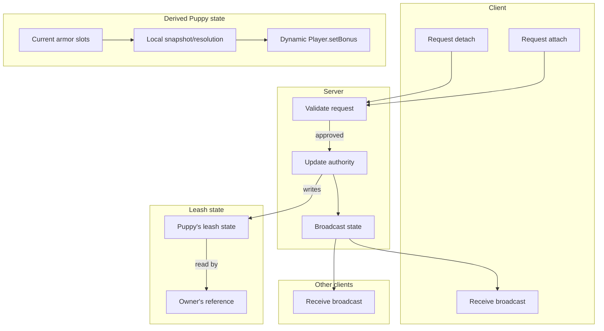

# Network Sync Model - How It Works

This document describes the synchronization model used by the Puppy equipment and leash systems in multiplayer. Equipment resolution is derived locally from the current armor slots; leash attachment is explicitly server-authoritative. No custom packet is used to send a Puppy set snapshot.

The leash system is server-authoritative. The client never decides on its own whether a leash connects; it asks the server, the server validates, and the result is broadcast back to every client. This keeps multiple players seeing the same leash state. Each side resolves recognized Ears/Tails from its synchronized armor slots, while the server remains authoritative for attachment-dependent gameplay effects.

### Concepts

- The server is the **single source of truth** for any leash connection. Whatever the server says is leashed, is leashed. Clients never modify the leash state directly.
- The Puppy set is **derived state**, not a separately synchronized set flag. The scanner reads the current vanilla armor array on each simulation, resolves the recognized Ears/Tails and their effects, and exposes `IsPuppy`. Normal Terraria equipment synchronization supplies the slots.
- A **request** is what a client sends when its owner wants to attach or detach. The request identifies the target puppy and, for an attach, the type of leash being used.
- **Validation** is what the server does with a request. It checks that the requester is not a puppy, the target is a puppy wearing a collar, the leash type is held, and the target is in range. If any check fails, the request is silently dropped.
- **Authority** is what the server updates when a request is approved. The puppy's leash state is set to point at the owner, and the active collar type is captured so it can be broadcast.
- A **broadcast** is what the server sends to every client after updating authority. Each client receives the new state and applies it to its local view of the puppy. The same broadcast is what the puppy client uses to update its own state.
- The **packet** carries the leash owner, the puppy being leashed, the type of leash item, and the type of collar item currently in the puppy's accessory slot. All four pieces are sent together so the receiving client can fully reconstruct the leash.
- **Rejoin** is handled by a separate full-state sync. When a player joins or changes dimension, their leash state is shipped to the new client directly so they see existing leashes immediately.
- A **stale state** can occur if a leash becomes invalid between ticks. The server-side tick detects the invalid connection, broadcasts a detach, and clears its authority; clients clear their local view when they receive the state.
- **Client-only visuals** are not gameplay synchronization. Bark audio is played only for the local player. Shiny Ears light, treasure highlights and bark star bursts, plus Shiny Tail platform dust, are skipped on dedicated and multiplayer servers. Carpet movement, stats, set checks and attached defensive effects remain simulation state.

### Work Sequence

1. **Equipment is resolved** - each side scans its current armor slots, aggregates recognized Puppy effects, derives `IsPuppy`, and builds the local dynamic set text. No Puppy equipment packet is exchanged.
2. **Owner right-clicks a puppy with a leash** - on the owner client, a request to attach is built. The request names the target puppy and the held leash type.
3. **Request is sent to the server** - the owner client transmits the request.
4. **Server receives the request** - the server runs the leash's validation rules against the requester, the target, and the leash.
5. **Validation passes** - the server writes the leash state on the puppy: the owner index, the leash type, and the active collar type. The collar is captured at this moment so it can be broadcast with the leash.
6. **Broadcast is sent to all clients** - the server packages the new leash state into a single packet and sends it to every connected client, including the owner and the puppy who originated the request.
7. **Clients apply the broadcast** - each receiving client updates its local view of the puppy. The leash becomes visible to everyone. The synchronized attachment can then be used for derived leash and pair effects.
8. **Attached effects run** - the server and clients validate the connection, run leash physics, and apply leash/collar effects. The attached pair service grants a matching Reinforced pair's defense and incoming knockback effect to the Puppy and Owner while the attachment is valid.
9. **Detach or invalidation** - an explicit detach request is validated by the server. If the leash becomes invalid because of distance, death, removing the collar, or losing Puppy status, the server broadcasts the detach and all clients clear their local state.
