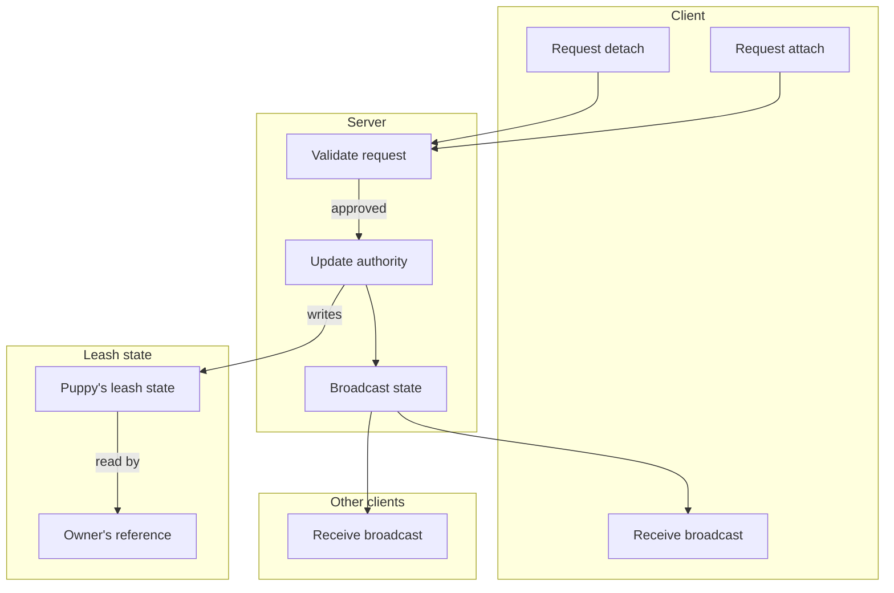

# Network Sync Model - How It Works

This document describes the synchronization model used for the leash system in multiplayer. No implementation details are listed here - only the conceptual relationships and the order in which things happen.

The leash system is server-authoritative. The client never decides on its own whether a leash connects; it asks the server, the server validates, and the result is broadcast back to every client. This keeps multiple players seeing the same leash state.

### Concepts

- The server is the **single source of truth** for any leash connection. Whatever the server says is leashed, is leashed. Clients never modify the leash state directly.
- A **request** is what a client sends when its owner wants to attach or detach. The request identifies the target puppy and, for an attach, the type of leash being used.
- **Validation** is what the server does with a request. It checks that the requester is not a puppy, the target is a puppy wearing a collar, the leash type is held, and the target is in range. If any check fails, the request is silently dropped.
- **Authority** is what the server updates when a request is approved. The puppy's leash state is set to point at the owner, and the active collar type is captured so it can be broadcast.
- A **broadcast** is what the server sends to every client after updating authority. Each client receives the new state and applies it to its local view of the puppy. The same broadcast is what the puppy client uses to update its own state.
- The **packet** carries the leash owner, the puppy being leashed, the type of leash item, and the type of collar item currently in the puppy's accessory slot. All four pieces are sent together so the receiving client can fully reconstruct the leash.
- **Rejoin** is handled by a separate full-state sync. When a player joins or changes dimension, their leash state is shipped to the new client directly so they see existing leashes immediately.
- A **stale state** can occur if a leash becomes invalid between ticks. The puppy client checks validity each tick and, if the connection is no longer valid, requests a detach so the server can clean up.

### Work Sequence

1. **Owner right-clicks a puppy with a leash** - on the owner client, a request to attach is built. The request names the target puppy and the held leash type.
2. **Request is sent to the server** - the owner client transmits the request.
3. **Server receives the request** - the server runs the leash's validation rules against the requester, the target, and the leash.
4. **Validation passes** - the server writes the leash state on the puppy: the owner index, the leash type, and the active collar type. The collar is captured at this moment so it can be broadcast with the leash.
5. **Broadcast is sent to all clients** - the server packages the new leash state into a single packet and sends it to every connected client, including the owner and the puppy who originated the request.
6. **Clients apply the broadcast** - each receiving client updates its local view of the puppy. The leash becomes visible to everyone. The owner client may use the new state immediately for buff calculation.
7. **Puppy client applies leash effects** - the puppy client, on the next tick, validates the connection, runs leash physics, and lets the leash apply its effect to the puppy.
8. **Owner client applies collar effects** - the owner client, on the next tick, finds the puppy in its leash scan and applies that puppy's collar effect to itself.
9. **Detach or invalidation** - the same flow runs in reverse for detach. If the leash becomes invalid because of distance, death, or removing the collar, the puppy client detects this and asks the server to clean up.
