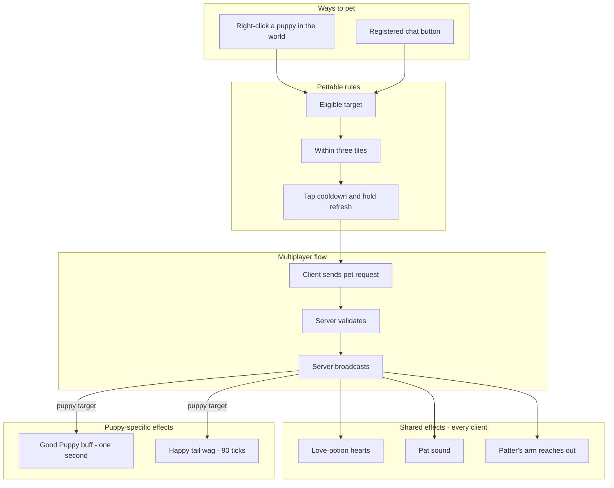

# Petting System - How It Works

This document describes the petting system: a friendly interaction that lets one player pet a puppy. No implementation details are listed here - only the conceptual relationships and the order in which things happen.

Right-clicking a puppy player in the world pets them, and holding the button keeps petting. A pet plays hearts, a pat sound and a reach animation, and grants the puppy the Good Puppy buff plus a happy tail wag. Town NPCs such as the Zoologist can also be registered for petting through a button in their chat panel. The generic rules and visuals live in an embedded utility library; the mod's own glue handles input, networking and the puppy-specific effects.

### Concepts

- **Petting** is a friendly interaction with a target in the world. The player right-clicks the target, and holding the button keeps petting. The initial tap is spaced by a short cooldown, and while the button is held the pet refreshes on its own interval.
- The interaction has a **range** of three tiles and a small **tap cooldown**. A hold keeps the pet alive and refreshes its effects, and hearts appear at their own interval rather than on every tick.
- **What petting does** - love-potion hearts float over the target, a pat sound plays, and the patter's arm reaches toward the target with a gentle bobbing motion. This shared animation is identical for every target and plays on every client.
- **Puppy effects** - a petted puppy receives the Good Puppy buff for one second, refreshed as long as petting continues, and a happy tail wag lasting 90 ticks. While the wag is active, the puppy's dog-form idle animation plays at double speed, as described in [Transformation System](Transformation-System.md).
- **Non-puppy targets** - only the shared animation plays. Puppy-specific effects such as the Good Puppy buff and the tail wag are applied only to puppy targets.
- **Pettable players** - a player can be petted only while they satisfy the puppy set condition: any recognized Ears plus any recognized Tail. The set is described in [Puppy Set System](Puppy-Set-System.md).
- **Pettable NPCs** - town NPCs are not pettable unless they are registered. A registered NPC can opt into a chat button, a world-click interaction, or both. The button's label is chosen by whoever registers the NPC; the Zoologist's button reads `pet <3`.
- **Multiplayer** - the client asks the server to pet. The server validates that the target is eligible, within range and off cooldown, applies the pet, and broadcasts. Hearts, sound and reach play on every client, while the puppy effects are applied where the target is a puppy. The request shape matches the leash and bark flows in [Network Sync Model](Network-Sync-Model.md).
- **Utility library** - the generic rules, visuals and registration API live in a small embedded utility library. The mod's glue handles input, networking and a plugin that adds the puppy-specific effects. Because the rules are generic, other mods can register their own pettable NPCs with their own labels, and any non-puppy target still receives the shared animation.

### Work Sequence

1. **A target becomes pettable** - a player wearing any recognized Ears and any recognized Tail satisfies the puppy set condition and becomes pettable. NPCs must be explicitly registered to be pettable at all.
2. **Player starts petting** - the player right-clicks a puppy within three tiles. The utility confirms the target is eligible and that the short tap cooldown has elapsed.
3. **The patter reaches out** - the patter turns toward the target and the reach animation begins. The animation is shared by every target.
4. **Shared visuals play** - love-potion hearts float over the target, a pat sound plays, and the animation is visible on every client.
5. **Puppy effects are applied** - if the target is a puppy, the Good Puppy buff is applied for one second and the happy tail wag starts for 90 ticks. The wag doubles the dog-form idle animation speed for its duration.
6. **Holding keeps petting** - while the button is held, the pet refreshes on the utility's interval, keeping the buff and wag alive and spawning hearts at their own interval. Releasing ends the pet, and the remaining effects expire on their own.
7. **Multiplayer round trip** - the client sends a pet request; the server validates the target, range and cooldown, then broadcasts. Every client replays the shared visuals, and puppy effects apply where the target is a puppy.
8. **NPC chat button** - a registered petting NPC can show a button in its dialogue panel. Clicking it pets that NPC through the same shared flow. The Zoologist's `pet <3` button is the built-in example, and the label belongs to the NPC's registration.
