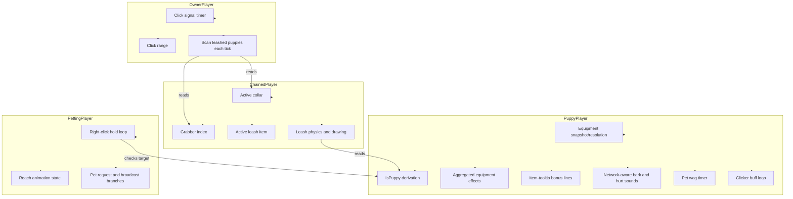

# Player State Hierarchy - How It Works

This document describes the split of responsibilities across the mod's player state classes. No implementation details are listed here - only what each class is responsible for and how they relate to each other.

Every connected player is tracked by four separate player state classes. Each class owns one concern and one concern only. Puppy equipment discovery is a small shared domain service, not another player state class. The generic petting rules live in an embedded utility library, and the puppy-specific petting effects are applied by a plugin that hooks into it.

### Concepts

- The **equipment model** scans the fixed vanilla armor layout and the extra accessory slots beyond it, records every recognized Ears/Tail entry, resolves the selected family pair, aggregates all individual effects with functional/vanity scaling, and derives the Puppy state. A matching pair is not required for `IsPuppy`.
- The **puppy class** owns everything about *being* a puppy: caching the equipment resolution, applying the aggregated effects, exposing puppy bonus lines for item tooltips, deriving the set state, network-aware barks and hurt sounds, the happy pet wag timer, the Shiny Tail hover timer, and the per-tick loop that grants the Good Puppy buff when a clicker is heard. For incoming damage it also queries the leash bonus service for any attached pair effect.
- The **chained class** owns everything about *being on a leash*: which collar is active, who is holding the other end, and which leash item created the connection. It runs the leash physics, draws the rope, and maintains the attachment state used by the leash bonus service.
- The **owner class** owns everything about *being an owner of a puppy*: clicker cooldowns, click range, and the scan that applies a leashed puppy's collar effect to the owner. It does not know about barks, hurt sounds, or the puppy's own state.
- The **petting class** owns everything about *petting targets in the world*: the right-click hold loop, the reach animation state, and every netmode branch that sends or applies a pet. The generic rules and visuals come from the embedded utility library; puppy-specific effects such as the Good Puppy buff and the tail wag are applied by a small plugin that hooks into that library.
- The **interplay** is deliberately narrow. The owner class reads the chained class to find puppies leashed to it. The chained class reads the puppy class to confirm eligibility. The puppy class owns clicker/bark behavior and queries the leash bonus service for attached defensive effects; it does not own or mutate the leash connection. The petting class consults the puppy class to decide whether puppy-specific effects apply.
- A single player may simultaneously be a **puppy, a chained puppy, an owner of other puppies, and a patter** depending on which items and interactions they have. Each role is tracked independently.

### Work Sequence

1. **Mod loads** - the equipment registry and four player classes are registered. Every connected player gets one instance of each player class.
2. **Puppy set is detected** - after equipment updates, the puppy class scans the armor slots, caches the snapshot/resolution, aggregates every recognized entry, and exposes `IsPuppy` when any recognized Ears and any accessory Tail are present.
3. **Chained state resets** - on every tick, the chained class clears the active collar. The collar is then re-set by whichever collar item is currently in the player's accessory slot.
4. **Puppy loop runs** - the puppy class applies equipment defense, movement, pick-speed, jump and outgoing knockback effects, exposes active bonus lines for item tooltips, decrements the shared bark cooldown, listens for clicker signals, applies the Good Puppy buff to any player within range of a clicker, and counts down the pet wag timer. Barks and hurt sounds go through the network-aware path when the game is in multiplayer.
5. **Chained loop runs** - if the player is currently leashed, the chained class validates the connection, applies the leash's effect to the puppy, runs physics, and draws the rope. The leash bonus service can apply a selected pair's attached defense to both sides.
6. **Owner loop runs** - the owner class scans for puppies leashed to this player. For each, it applies the puppy's collar effect to the owner.
7. **Petting loop runs** - the petting class watches the local player's right-click hold, resolves an eligible target, drives the reach animation, and either applies the pet locally or sends a request and waits for the broadcast. The plugin applies the puppy-specific buff and wag when the target is a puppy.
8. **Round trip completes** - all four classes have done their work. The next tick begins.
