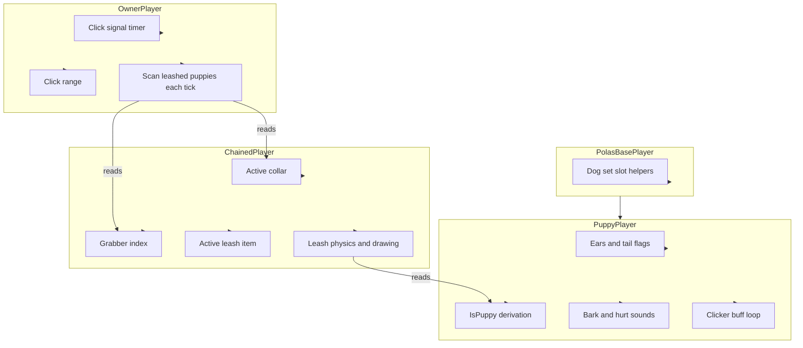

# Player State Hierarchy - How It Works

This document describes the split of responsibilities across the mod's player state classes. No implementation details are listed here - only what each class is responsible for and how they relate to each other.

Every connected player is tracked by four separate player state classes. Each class owns one concern and one concern only. The classes never duplicate state; they read each other through well-defined access points.

### Concepts

- The **base class** holds slot helpers that all subclasses reuse. It owns no behavior; it just exposes where the dog ears and dog tail are sitting in the player's armor and vanity slots.
- The **puppy class** owns everything about *being* a puppy: detecting the set, barks, hurt sounds, and the per-tick loop that grants the Good Puppy buff when a clicker is heard. It is read-only with respect to the leash system; it never reaches into a leash state.
- The **chained class** owns everything about *being on a leash*: which collar is active, who is holding the other end, and which leash item created the connection. It runs the leash physics, draws the rope, and exposes the leash's effect to the puppy each tick.
- The **owner class** owns everything about *being an owner of a puppy*: clicker cooldowns, click range, and the scan that applies a leashed puppy's collar effect to the owner. It does not know about barks, hurt sounds, or the puppy's own state.
- The **interplay** is one-directional. The owner class reads the chained class to find puppies leashed to it. The chained class reads the puppy class to confirm eligibility. The puppy class is unaware of the leash and clicker systems.
- The **base** is a shared foundation. The puppy class extends the base; the chained and owner classes do not. This keeps the leash and clicker systems independent of the puppy set.
- A single player may simultaneously be a **puppy, a chained puppy, and an owner of other puppies** depending on which items and connections they have. Each role is tracked independently.

### Work Sequence

1. **Mod loads** - the four classes are registered. Every connected player gets one instance of each.
2. **Puppy set is detected** - on every tick, the puppy class asks the base class where the dog ears and dog tail are sitting. The combined result is exposed as a simple is-puppy flag.
3. **Chained state resets** - on every tick, the chained class clears the active collar. The collar is then re-set by whichever collar item is currently in the player's accessory slot.
4. **Puppy loop runs** - the puppy class runs its per-tick logic. This includes decrementing the bark cooldown, listening for clicker signals, and applying the Good Puppy buff to any player within range of a clicker.
5. **Chained loop runs** - if the player is currently leashed, the chained class validates the connection, applies the leash's effect to the puppy, runs physics, and draws the rope.
6. **Owner loop runs** - the owner class scans for puppies leashed to this player. For each, it applies the puppy's collar effect to the owner.
7. **Round trip completes** - all four classes have done their work. The next tick begins.
