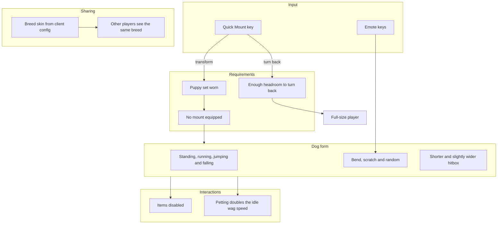

# Transformation System - How It Works

This document describes the puppy transformation. No implementation details are listed here - only the conceptual relationships and the order in which things happen.

A player wearing a puppy set can turn into a dog and back with the Quick Mount key, as long as no mount is equipped. The dog has its own animations, emotes and a shorter, wider hitbox. The breed is chosen in the client config and shared with other players, so everyone sees the same dog.

### Concepts

- **Transformation** is toggled with the Quick Mount key, which defaults to R. With any puppy set and no mount equipped, the key turns the player into a dog; pressing it again turns back. With a mount equipped, the key keeps its normal mount behavior.
- **Turning back** requires about 2.7 tiles of headroom. If the space is blocked, the player stays in dog form. The transform keeps the wider hitbox clear of walls, so transforming next to a wall does not push the player into it.
- **Items are disabled** while transformed. The dog cannot use, hold or swing items.
- **Dog animations** cover four locomotion states: standing, running, jumping and falling. The running animation follows movement speed, and the falling animation takes over once the dog is moving downward.
- **Emotes** are triggered by the emote keys, which default to bend (I), scratch (O) and random (P). Random picks bend or scratch. Emotes only start while the dog is grounded and standing still, and they end if the dog moves. Scratch has a chance to play faster than usual.
- **Petting** - while a happy tail wag from petting is active, the dog's idle animation plays at double speed. The wag and its duration are described in [Petting System](Petting-System.md).
- **Hitbox** - the dog's hitbox is shorter and slightly wider than the player's. The transform re-anchors the hitbox while transformed so the wider body stays clear of obstacles.
- **Breed** - six skins are available. The breed is chosen in the client config and travels with the transform, so every client draws the same dog. Changing the choice while transformed updates the breed for everyone.

### Work Sequence

1. **Player wears a puppy set** - any recognized Ears plus any recognized Tail. With no mount equipped, the transformation becomes available.
2. **Player presses Quick Mount** - the player turns into a dog. A puff of dust plays, and the breed is copied from the player's client config.
3. **Dog form is active** - items are disabled, and the dog switches between the standing, running, jumping and falling animations based on its movement.
4. **Player presses an emote key** - bend, scratch or random starts while the dog is grounded and still. The emote ends early if the dog moves, and scratch sometimes plays faster.
5. **Player is petted** - the pet grants the happy tail wag; while it lasts, the idle animation plays at double speed.
6. **Breed is shared** - the chosen breed travels with the transform, so other players see the same breed. A config change while transformed updates the skin for everyone.
7. **Player presses Quick Mount again** - with about 2.7 tiles of headroom, the player returns to full size; otherwise the dog stays. The full-size hitbox returns on the next successful attempt.
