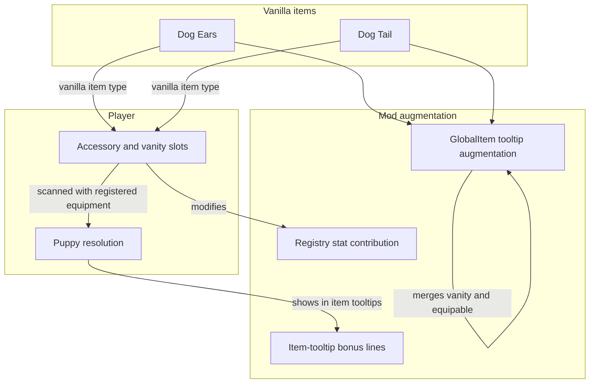

# Vanilla Item Augmentation - How It Works

This document describes how the mod enhances the vanilla dog ears and dog tail without replacing them. The shared Puppy set architecture, including custom Ears and Tails, is covered in [Puppy Set System](Puppy-Set-System.md); this page focuses on the vanilla-item integration.

The vanilla game has a dog ears item and a dog tail item. The mod leaves those items in place and augments their tooltips through GlobalItem hooks while the Puppy registry supplies their set identity and stat contributions. The result is the same vanilla item instances with extra information and Puppy behavior layered on top.

### Concepts

- The mod does **not replace** the dog ears or dog tail. The same items the vanilla game provides continue to exist, with the same icons, the same internal type, and the same slot behavior.
- The mod **augments** those items by reacting to their vanilla item types. `DogEarsGlobalItem` and `DogTailGlobalItem` send their tooltips through the shared Puppy tooltip helper; the equipment registry supplies their family and individual Puppy stats.
- The tooltip is **merged**. Vanilla shows separate lines for equipable and vanity. The mod combines those lines so the player sees a single clear indication that the item works in both contexts.
- The **vanity line** is replaced with a flavor line. The vanilla "this is a vanity item" text is swapped for a friendly, on-brand message that invites the player to enjoy the puppy aesthetic.
- A **set bonus** is shown when the Puppy resolution contains any recognized Ears and any valid accessory Tail. The families do not have to match. The item tooltip explains how to bark and adds the pair line only when a matching family pair has one.
- The mod contributes to the **puppy's stats** while recognized entries are equipped. Functional entries contribute full strength; vanity entries contribute half strength. Every recognized entry contributes, not just the entries selected for a pair.
- The augmentation is **transparent**. A player who has never heard of the mod and views or equips a vanilla dog item still sees the merged tooltip and flavor line, while the puppy bonus lines appear in the item tooltip only when the local player currently has an active Puppy resolution.
- The vanilla items are still **craftable through the vanilla recipe**. The mod does not add a new way to obtain them, nor does it remove the existing way.

### Work Sequence

1. **Mod loads** - the vanilla item types are registered alongside the custom Puppy equipment definitions.
2. **Player views a vanilla tooltip** - the matching GlobalItem hook merges the equipable/vanity presentation, adds Puppy flavor and stat information, and keeps the vanilla item itself unchanged.
3. **Player equips or vanity-wears recognized entries** - the Puppy scanner records the armor slots and the resolver aggregates the individual effects with the functional/vanity multiplier.
4. **A valid Puppy state appears** - any recognized Ears plus any recognized accessory Tail enables the bark set state, regardless of family match.
5. **Puppy bonus lines are supplied to the item tooltip** - the relevant item tooltip shows the localized bark line and any selected pair line (`forTooltip: true`).
6. **Player uses the set bonus** - on the next allowed double-tap, the player barks. Bark audio is handled through the networked bark path: a local prediction, server validation and broadcast, and per-listener volume with distance falloff. Cosmetic reactions such as the Shiny Ears star burst remain client-side visuals.
