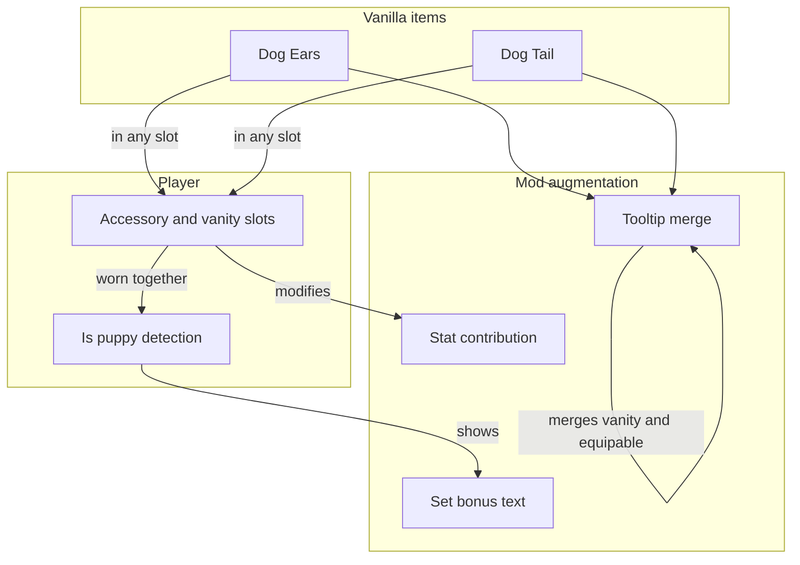

# Vanilla Item Augmentation - How It Works

This document describes how the mod enhances the vanilla dog ears and dog tail without replacing them. No implementation details are listed here - only the conceptual changes that the mod makes to those items.

The vanilla game has a dog ears item and a dog tail item. The mod leaves those items in place and instead augments their tooltip and behavior. The result is the same items the player already knows, but with extra information and a small gameplay effect that ties them to the puppy system.

### Concepts

- The mod does **not replace** the dog ears or dog tail. The same items the vanilla game provides continue to exist, with the same icons, the same internal type, and the same slot behavior.
- The mod **augments** those items by reacting to them. When a player holds, wears, or equips a dog ears or dog tail, the mod adds extra information and behavior on top of what vanilla already does.
- The tooltip is **merged**. Vanilla shows separate lines for equipable and vanity. The mod combines those lines so the player sees a single clear indication that the item works in both contexts.
- The **vanity line** is replaced with a flavor line. The vanilla "this is a vanity item" text is swapped for a friendly, on-brand message that invites the player to enjoy the puppy aesthetic.
- A **set bonus** is shown when both the dog ears and the dog tail are equipped or worn as vanity. The set bonus explains how to bark and what the player gets out of the puppy set. The bonus is shown only to players who are actually puppies.
- The mod contributes to the **puppy's stats** while either item is worn. Wearing either item in an accessory slot contributes a small bonus to the relevant stat. Wearing either item in a vanity slot contributes a smaller version of the same bonus. Wearing both makes the player a puppy.
- The augmentation is **transparent**. A player who has never heard of the mod and equips the dog ears will still see the merged tooltip, the flavor line, and the set bonus. The mod does not require the player to opt in.
- The vanilla items are still **craftable through the vanilla recipe**. The mod does not add a new way to obtain them, nor does it remove the existing way.

### Work Sequence

1. **Mod loads** - the augmentation registers. The vanilla dog ears and dog tail items are now known to the mod as augmentable items.
2. **Player acquires the dog ears or dog tail** - the player obtains the item through normal play. The item itself is unchanged.
3. **Player views the item's tooltip** - the mod intercepts the tooltip and applies the augmentation: the equipable and vanity lines are merged, the flavor line replaces the vanilla vanity line, and a stat line is added.
4. **Player equips or vanity-wears the items** - the item sits in an accessory or vanity slot. The mod's stat contribution kicks in immediately.
5. **Player wears both items** - the player is now a puppy. The set bonus is shown, explaining how to bark.
6. **Player uses the set bonus** - on the next double-tap, the player barks. The bark uses the player's chosen pitch style and volume.
